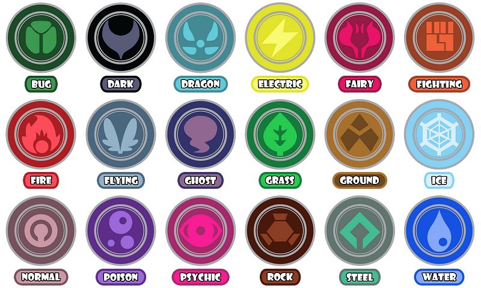

# PokemonClustering
## Clustering Project based off Pokemon stats

One of the most prominent ways to divide Pokemon is by their type (e.g. Fire, Water, etc.). This tells you a lot about a Pokemon: their strengths, weaknesses, what moves they can use, etc. However, there are an awful lot of types at this point (18 as of the latest generation which is a bit much to think about all at once). Is there another way to cluster Pokemon than by type to see their potential in battle? Let's find out!
List of Pokemon types for the uninitiated

In this project I looked at Pokemon Generation 1–8 and seeing how I could group without using type information. I used K-means clustering to group them

Each Pokemon has a number of governing 'stats' that determine how strong it is in terms of making attacks, how fast it is, and how much damage it can take in battle. These 'stats' differ across Pokemon so even Pokemon of the same type can have wildly different stats. If we add up all the stats for a Pokemon we'll have a rating of their total stat points which gives an idea of how powerful the Pokemon is overall. Some Pokemon (particularly those who are 'unevolved') will have lower stat totals. I've excluded the more 'special' Pokemon like Legendaries to keep things on a relatively even playing field.

With that out of the way let's dive in. The stats that we're using as inputs to our model are as follows:

1. HP (Hit Points) - Ability to take damage without fainting
2. Attack - Power of physical attacks
3. Defense - Resistance to physical attacks
4. Special Attack - Power of special attacks
5. Special Defense - Resistance to special attacks
6. Speed - Ability to go first in battle
7. Total Points - Sum of all points

There are plenty of other features about a Pokemon (such as how long it takes to hatch from an egg, or how friendly it is to start off with), but none of these tie in directly with battling. Others like 'ability' are often 1:1 with specific Pokemon evolution lines. For simplicity, we'll stick with the basics.

## Clustering

I used K-means as my method of clustering. K-means attempts to break data down into K number of clusters according to their center points (or centroids). It's an iterative process where it randomly picks a point at first for each centroid and then with each iteration the centroids are moved to better represent the data. We do this by minimizing error (distances between points and their cluster centroid). The better each cluster centroid represents the data in the cluster, the lower the error.
I won't get into the math here, but its enough to know that what we're trying to develop clusters using their center points. 
Note: K-Means works best on 'blobular' data. 

Almost immediately we run into an issue which will effect clustering. We have a bimodal distribution of points with some weaker (unevolved) Pokemon on the left and stronger Pokemon on the right. If we run a clustering on these groups we'll pretty much always get two clusters (small and strong) which isn't very interesting.

I opted to separate these groups into two separate sets of clusters around Total Points of 350. We'll refer to these as small Pokemon (≤ 350) and strong Pokemon(>350) from now on.
In other words, we don't want to compare Caterpie (left) to Typhlosion (right)

With that out of the way we can get to the clusters. I opted for Silhouette coefficient as my means of determining K (the number of clusters). Silhouette is essentially a measure of how similar each datapoint is to those in its own cluster compared to others. When looking at it we're going for the maximum score, so in the case of the graph below we see that 5 is the optimum solution for strong Pokemon. Repeating this approach for the small Pokemon we find 3 clusters.

Unfortunately, its impossible for humans to create much less comprehend a graph that could easily represent all our data points. Therefore, for representation of my clusters I'll be using PCA. PCA or Principle Components Analysis is a method for combining variables into PCs or Principle Components. This can be helpful in cases like these to represent our data in a two dimensional space. When we do this we do lose some information as not everything can generally be contained in 2 (or even 3) PCs.
Below is a PCA chart for both cluster groups. Both groups lost a lot of information being confined to only two PCs, so take these with a grain of salt. In particular, the strong Pokemon clusters sit on top of eachother with just a couple PCs.
First two PCs for each of strong Pokemon (left) and small Pokemon (right), colored by clusterFor more info on the topic of PCA I'll point you to StatQuest

## Strong Pokemon Clusters

Let's take a look at how our abilities mapped to each cluster:
Strong Pokemon Radar Plot - Scaled 0 to 1 with 1 being the maximum mean among clusters

For strong Pokemon our clusters correspond to the following stats:

Cluster 0: Lower stats across the board, tended to be middle Pokemon in 3 Pokemon evolutionary chains or weaker Pokemon even when evolved.
Radar Plot & Proportion of Types within Cluster 

Cluster 1: High special attack, special defense and speed. This group contains a lot of 'special' types like Psychic and Fire
Radar Plot & Proportion of Types within Cluster 

Cluster 2: High HP Pokemon (e.g. Chansey). This group is dominated by Water, Normal and Ground types who tend to be chunkier.
Radar Plot & Proportion of Types within Cluster 

Cluster 3: High stats in everything, but particularly both attacks, special defense and speed. Lots of Dragon type and pseudo-legendary Pokemon in this group.
Radar Plot & Proportion of Types within Cluster 

Cluster 4: High defense Pokemon. Primarily steel and rock types with higher natural defenses
Radar Plot & Proportion of Types within Cluster 

##Small Pokemon Clusters

For our small Pokemon our clusters also corresponded to stats, but much more broadly. It is worth noting that many of the weaker Pokemon in the games tend to be water, grass, normal and bug as these are some of the most common 'early game' Pokemon:
Small Pokemon Radar Plot - Scaled 0 to 1 with 1 being the maximum mean among clusters

Cluster 0: High total stats focused on attack, defense, and hp. Includes a lot of hardier types like ground, grass, water, rock and steel types.
Cluster 1: High total stats focused on special attack, special defense and speed. Includes many water, grass, psychic and fire type Pokemon.
Cluster 2: Low stats, these Pokemon are generally weak, but may become much stronger after evolution (a lot of weaker Normal types and Bug types)